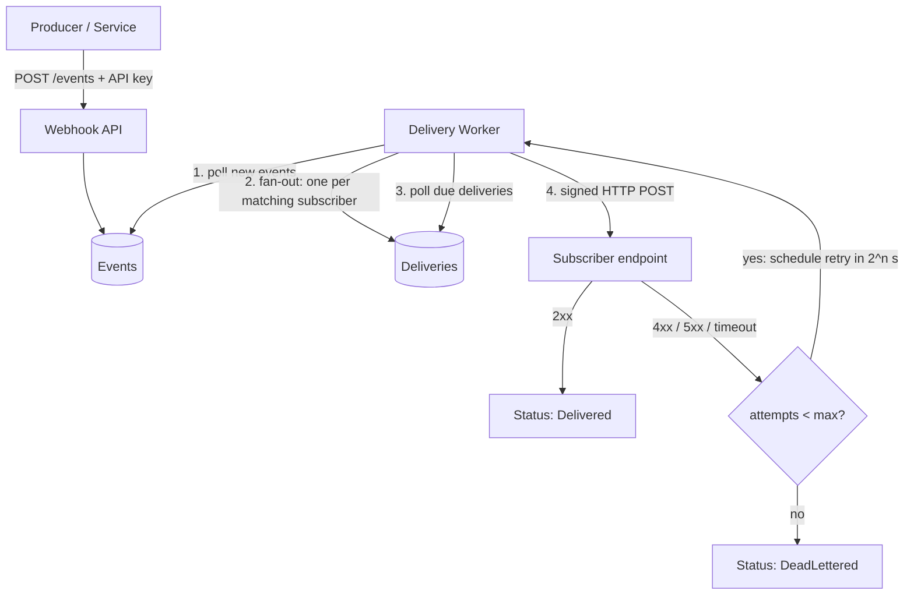

# Webhook Delivery System

A reliable, at-least-once **webhook delivery platform** built with ASP.NET Core (.NET 10), PostgreSQL, and React. It ingests events, fans them out to subscribers, and guarantees delivery through automatic retries with exponential backoff, dead-lettering, and HMAC-signed payloads — the same reliability patterns used by Stripe, GitHub, and Shopify.

This isn't a CRUD app. It's a small piece of distributed-systems infrastructure: a queue, a background worker, and the failure-handling machinery that makes "deliver this event to that URL" actually trustworthy when the network and the receiver can't be trusted.

---

## Why this project exists

Sending a webhook is easy. *Guaranteeing* it arrives is not. Subscribers go down, time out, return 500s, or come back to life thirty seconds later. A naive "fire an HTTP POST and hope" approach silently loses events the moment anything goes wrong.

This system treats every delivery as an obligation that must reach a terminal state — **delivered** or, after exhausting retries, **dead-lettered** — never silently dropped. Every attempt is recorded, every payload is signed, and the whole pipeline is observable from a live dashboard.

---

## Key features

- **Event ingestion** with API-key authentication, so only trusted producers can publish events.
- **Subscription management** — register endpoints that should receive specific event types.
- **Background delivery worker** that fans each event out to all matching subscribers and delivers it over HTTP.
- **Automatic retries with exponential backoff** (2s → 4s → 8s → 16s) so a temporarily-unavailable subscriber recovers on its own.
- **Dead-letter handling** — deliveries that fail past a maximum attempt count are quarantined with a full audit trail instead of being lost or retried forever.
- **HMAC-SHA256 payload signing** — every webhook carries an `X-Signature` header so receivers can verify authenticity and integrity.
- **Full delivery observability** — a React dashboard shows subscriptions, events, per-subscriber delivery status, and every individual attempt, auto-refreshing in real time.

---

## Architecture



The system has three moving parts:

1. **The API** accepts and stores events and manages subscriptions. It does *no* delivery work itself — ingestion is fast and never blocked by a slow subscriber.
2. **The delivery worker** is a long-running `BackgroundService` that polls the database on a fixed interval. Each cycle it (a) turns brand-new events into delivery jobs and (b) processes every delivery that's due.
3. **PostgreSQL** is both the store of record and the work queue. A delivery's `NextAttemptAt` timestamp *is* the schedule — backoff is simply "push this time further into the future after each failure."

This decoupling is the core design decision: producers get an instant response, and the heavy, failure-prone work of actually reaching subscribers happens asynchronously and durably in the background.

---

## How reliability works

### Deliveries vs. attempts

The data model separates two concepts that are easy to conflate:

- A **Delivery** is the *obligation* to get one event to one subscriber. It has a status (`Pending`, `Delivered`, or `DeadLettered`), an attempt count, and a next-attempt time.
- A **DeliveryAttempt** is a single *try* — one HTTP request, with its status code, response body, duration, and any error.

One delivery accumulates many attempts. This separation is what makes per-subscriber retry state expressible: an event can be delivered to subscriber A while still being retried for subscriber B, and each retry is recorded without losing the history.

### Retries and exponential backoff

When an attempt fails (a non-2xx response, a timeout, or a connection error), the worker doesn't give up — it increments the attempt count and reschedules the delivery for `2^attempt` seconds in the future. A subscriber that's briefly down recovers automatically once it's back, without anyone intervening. Backoff prevents a struggling subscriber from being hammered while it tries to recover.

### Dead-lettering

Retries are capped. Once a delivery has failed the maximum number of times (5), it's marked `DeadLettered` and stops being retried. The event isn't lost — it's quarantined with its full attempt history intact, so a permanently-broken subscriber can be investigated rather than silently dropping events or retrying forever.

### Signing

Every outgoing payload is signed with an HMAC-SHA256 computed over the exact request body, keyed with a secret unique to each subscription. The signature travels in an `X-Signature: sha256=<hex>` header. Subscribers recompute it with their copy of the secret to prove the webhook genuinely came from this system and wasn't tampered with in transit. (See [Verifying webhook signatures](#verifying-webhook-signatures).)

---

## Data model

| Entity | Purpose | Notable fields |
| --- | --- | --- |
| **Event** | An occurrence to be delivered | `EventType`, `Payload`, `ProcessedAt` (fan-out marker) |
| **Subscription** | A registered receiver | `Url`, `EventType`, `IsActive`, `Secret` (signing key) |
| **Delivery** | The obligation to deliver one event to one subscriber | `Status`, `AttemptCount`, `NextAttemptAt`, `CompletedAt` |
| **DeliveryAttempt** | A single HTTP attempt | `AttemptNumber`, `Success`, `StatusCode`, `DurationMs`, `ErrorMessage` |

---

## API reference

| Method | Route | Description |
| --- | --- | --- |
| `GET` | `/health` | Liveness check |
| `POST` | `/events` | Ingest an event (**requires `X-Api-Key` header**) |
| `GET` | `/events` | List events, newest first |
| `POST` | `/subscriptions` | Create a subscription (returns the signing `secret` once) |
| `GET` | `/subscriptions` | List subscriptions (secret never returned) |
| `DELETE` | `/subscriptions/{id}` | Remove a subscription |
| `GET` | `/deliveries` | List deliveries with status and attempt counts |
| `GET` | `/delivery-attempts` | List every individual delivery attempt |

### Example: publish an event

```bash
curl -X POST http://localhost:5180/events \
  -H "Content-Type: application/json" \
  -H "X-Api-Key: dev-secret-key-123" \
  -d '{"eventType":"order.created","payload":"{\"orderId\":42}"}'
```

---

## Tech stack

- **Backend:** ASP.NET Core (.NET 10) minimal API
- **Database:** PostgreSQL via Entity Framework Core (Npgsql)
- **Background processing:** .NET `BackgroundService` (hosted service) with scoped `DbContext` per cycle
- **Frontend:** React + TypeScript (Vite)
- **Infrastructure:** Docker Compose (PostgreSQL + Redis)

---

## Running locally

### Prerequisites

- .NET 10 SDK
- Node.js 20+
- Docker Desktop

### 1. Start the infrastructure

From the project root:

```bash
docker compose up -d
```

This starts PostgreSQL (mapped to host port **5544** to avoid colliding with any native Postgres install) and Redis on 6379.

### 2. Run the API

```bash
cd backend/WebhookApi
dotnet ef database update   # apply migrations
dotnet run                  # listens on http://localhost:5180
```

### 3. Run the dashboard

```bash
cd frontend
npm install
npm run dev                 # serves http://localhost:5173
```

Open **http://localhost:5173** to see the live dashboard.

> **Note on configuration:** the database connection string and the ingest API key live in `appsettings.json`. The values committed here are development defaults — in a real deployment they'd come from environment variables or a secrets store.

### Trying it out

The API exposes test-receiver endpoints to demonstrate the reliability behavior without needing an external service:

- `POST /test-receiver` — always succeeds (and logs the signature it received)
- `POST /test-receiver/fail` — always returns 500 (watch a delivery retry, then dead-letter)
- `POST /test-receiver/flaky` — fails twice then succeeds (watch a delivery retry, then recover)

Point a subscription at one of these, publish a matching event, and watch the Deliveries panel tell the story.

---

## Verifying webhook signatures

Every webhook includes an `X-Signature` header:

    X-Signature: sha256=<hex>

The value is an HMAC-SHA256 of the **exact request body**, keyed with the secret you received when your subscription was created. To confirm a webhook genuinely came from this system and wasn't altered in transit, recompute the signature and compare.

### Node.js (Express) example

```js
const crypto = require("crypto");

const SECRET = process.env.WEBHOOK_SECRET; // shown once at subscription creation

function isValid(rawBody, signatureHeader) {
  const expected =
    "sha256=" +
    crypto.createHmac("sha256", SECRET).update(rawBody).digest("hex");

  const a = Buffer.from(signatureHeader);
  const b = Buffer.from(expected);
  return a.length === b.length && crypto.timingSafeEqual(a, b);
}

// Verify against the RAW body, BEFORE parsing JSON.
app.post("/webhooks", express.raw({ type: "application/json" }), (req, res) => {
  if (!isValid(req.body, req.header("X-Signature") || "")) {
    return res.status(401).send("Invalid signature");
  }
  const event = JSON.parse(req.body.toString());
  // ... handle the event ...
  res.sendStatus(200);
});
```

**The most common mistake:** verifying against a *re-serialized* JSON object instead of the raw bytes. A change in whitespace or key order alters the hash and breaks verification. Always hash the body exactly as it arrived. The constant-time compare (`timingSafeEqual`) avoids leaking information through timing.

---

## Project status & roadmap

**Built and working:**

- ✅ Event ingestion with API-key authentication
- ✅ Subscription management
- ✅ Background delivery worker with fan-out
- ✅ Retries with exponential backoff
- ✅ Maximum-attempt cap and dead-letter store
- ✅ HMAC-SHA256 payload signing
- ✅ Live React dashboard for full delivery observability

**Planned:**

- ⬜ Redis-backed delivery queue to replace database polling
- ⬜ Idempotency keys to guarantee exactly-once processing on the receiver side
- ⬜ Manual "retry now" action for dead-lettered deliveries from the dashboard
- ⬜ JWT authentication for the dashboard
- ⬜ Automated tests (xUnit for the API, Playwright for the dashboard)
- ⬜ CI pipeline (GitHub Actions) and cloud deployment

---

## What I learned building this

- **Why ingestion and delivery must be decoupled** — keeping the API fast means pushing all the slow, failure-prone work into an asynchronous worker.
- **How to model retry state correctly** — separating the delivery obligation from individual attempts is what makes per-subscriber retries and a clean audit trail possible.
- **That a timestamp can be a scheduler** — exponential backoff falls out naturally from a single `NextAttemptAt` column and a "what's due now?" query.
- **How real webhook security works** — HMAC signing, raw-body verification, and constant-time comparison, the same way major platforms secure their webhooks.
