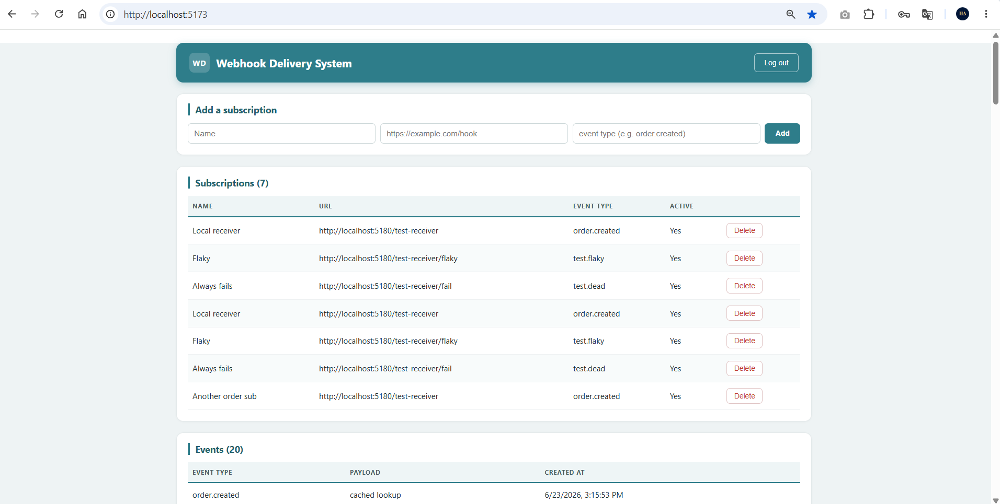
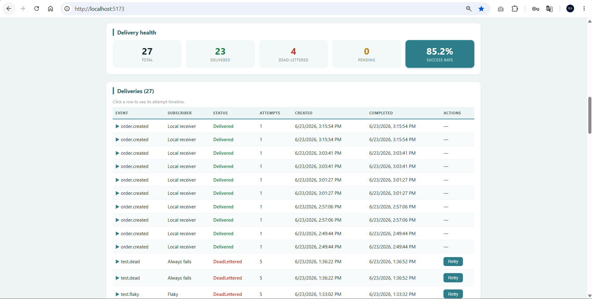
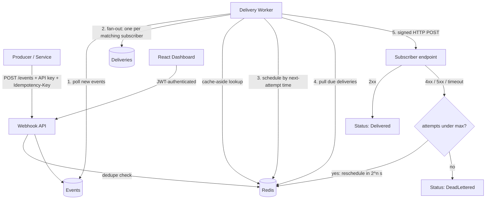

# Webhook Delivery System

A reliable, at-least-once **webhook delivery platform** built with ASP.NET Core (.NET 10), PostgreSQL, Redis, and React. It ingests events, fans them out to subscribers, and guarantees delivery through automatic retries with exponential backoff, dead-lettering, and HMAC-signed payloads — the same reliability patterns used by Stripe, GitHub, and Shopify.

This isn't a CRUD app. It's a small piece of distributed-systems infrastructure: a durable event store, a Redis-backed scheduler, a background delivery worker, and the failure-handling machinery that makes "deliver this event to that URL" actually trustworthy when the network and the receiver can't be trusted. It's containerized, tested, and wired into CI.

---

## Why this project exists

Sending a webhook is easy. *Guaranteeing* it arrives is not. Subscribers go down, time out, return 500s, or come back to life thirty seconds later. A naive "fire an HTTP POST and hope" approach silently loses events the moment anything goes wrong.

This system treats every delivery as an obligation that must reach a terminal state — **delivered** or, after exhausting retries, **dead-lettered** — never silently dropped. Every attempt is recorded, every payload is signed, duplicates are rejected, and the whole pipeline is observable from a secured, live dashboard.

---

## Key features

- **Event ingestion** with API-key authentication, so only trusted producers can publish events.
- **Idempotency keys** — a producer can safely retry a publish without creating duplicate events (the same guarantee Stripe's API gives).
- **Subscription management** — register endpoints that should receive specific event types.
- **Redis-backed scheduling** — a sorted set keyed by next-attempt time decides which deliveries are due, replacing database polling.
- **Background delivery worker** that fans each event out to all matching subscribers and delivers it over HTTP.
- **Automatic retries with exponential backoff** (2s → 4s → 8s → 16s) so a temporarily-unavailable subscriber recovers on its own.
- **Dead-letter handling** — deliveries that fail past a maximum attempt count are quarantined with a full audit trail instead of being lost or retried forever.
- **Manual redelivery** — an operator can re-queue a dead-lettered delivery from the dashboard.
- **HMAC-SHA256 payload signing** — every webhook carries an `X-Signature` header so receivers can verify authenticity and integrity.
- **Subscription caching** — active-subscriber lookups are cached in Redis (cache-aside) and invalidated on write, cutting database load on the hot path.
- **JWT-secured dashboard** — operator login protects all management endpoints; event producers use a separate API key.
- **Full delivery observability** — a React dashboard shows subscriptions, events, per-subscriber delivery status, an expandable attempt timeline, and live success-rate stats.
- **Tested and CI-gated** — the retry/backoff/dead-letter logic is unit-tested with xUnit, and GitHub Actions builds and runs the tests on every push.

 
---

## Architecture



The system has a few moving parts:

1. **The API** accepts and stores events, manages subscriptions, and serves the dashboard's data. It does *no* delivery work itself — ingestion is fast and never blocked by a slow subscriber.
2. **The delivery worker** is a long-running `BackgroundService`. Each cycle it turns brand-new events into delivery jobs, schedules them in Redis, then processes whatever Redis reports as due.
3. **PostgreSQL** is the durable store of record for events, subscriptions, deliveries, and attempts.
4. **Redis** is the low-latency layer: the delivery schedule (a sorted set), idempotency keys (with TTL), and the subscription cache.

The core design decision: **Postgres is the source of truth; Redis is a fast pointer to it.** When the worker pops a delivery id from Redis, it still loads the real row from Postgres, does the work, and updates the durable record. If Redis were lost, the worker rebuilds the schedule from Postgres on startup — so the fast layer is never the system of record.

---

## How reliability works

### Deliveries vs. attempts

The data model separates two concepts that are easy to conflate:

- A **Delivery** is the *obligation* to get one event to one subscriber. It has a status (`Pending`, `Delivered`, or `DeadLettered`), an attempt count, and a next-attempt time.
- A **DeliveryAttempt** is a single *try* — one HTTP request, with its status code, response body, duration, and any error.

One delivery accumulates many attempts. This separation is what makes per-subscriber retry state expressible: an event can be delivered to subscriber A while still being retried for subscriber B, with each retry recorded.

### Scheduling with a Redis sorted set

Instead of repeatedly asking Postgres "which deliveries are due?", each due delivery is stored in a Redis sorted set with its **next-attempt time (as a Unix timestamp) as the score**. "What's due now?" becomes a single range query for everything scored at or before the current time. Rescheduling after a failure is just re-adding the id with a larger score. On startup, the worker seeds this set from every `Pending` delivery in Postgres, so the schedule survives a Redis restart.

### Retries and exponential backoff

When an attempt fails (a non-2xx response, a timeout, or a connection error), the worker reschedules the delivery for `2^attempt` seconds in the future. A subscriber that's briefly down recovers automatically once it's back, and backoff prevents a struggling subscriber from being hammered while it tries to recover.

The decision — *succeed, retry, or give up?* — lives in a pure, dependency-free `DeliveryPolicy` function, separate from the database and HTTP side-effects. That separation is what makes it unit-testable (see [Testing](#testing)).

### Dead-lettering and manual redelivery

Retries are capped at five attempts. Once exhausted, a delivery is marked `DeadLettered` and stops being retried — quarantined with its full attempt history rather than lost or retried forever. An operator can re-queue a dead-lettered delivery from the dashboard, which resets it to `Pending` and reschedules it in Redis.

### Idempotency

Producers may attach an `Idempotency-Key` header when publishing. The first time a key is seen, the event is created and the key is remembered in Redis with a 24-hour TTL; a repeat of the same key returns the original event instead of creating a duplicate. This makes a producer's network retry safe.

### Signing

Every outgoing payload is signed with an HMAC-SHA256 computed over the exact request body, keyed with a secret unique to each subscription. The signature travels in an `X-Signature: sha256=<hex>` header. (See [Verifying webhook signatures](#verifying-webhook-signatures).)

---

## Security model

The system has **two distinct auth mechanisms for two distinct audiences**:

- **Event producers** (machines publishing events) authenticate to `POST /events` with an **API key** in the `X-Api-Key` header.
- **The operator** (the human managing the system) authenticates to the dashboard with a **JWT**. Login returns a signed, stateless token that's sent as `Authorization: Bearer <token>` on every management request. All subscription, delivery, retry, and stats endpoints require it.

Keeping these separate is deliberate: the producer-facing ingestion path and the operator-facing dashboard have different threat models and different credentials.

---

## Data model

| Entity | Purpose | Notable fields |
| --- | --- | --- |
| **Event** | An occurrence to be delivered | `EventType`, `Payload`, `ProcessedAt` (fan-out marker) |
| **Subscription** | A registered receiver | `Url`, `EventType`, `IsActive`, `Secret` (per-subscriber signing key) |
| **Delivery** | The obligation to deliver one event to one subscriber | `Status`, `AttemptCount`, `NextAttemptAt`, `CompletedAt` |
| **DeliveryAttempt** | A single HTTP attempt | `AttemptNumber`, `Success`, `StatusCode`, `DurationMs`, `ErrorMessage` |

---

## API reference

| Method | Route | Auth | Description |
| --- | --- | --- | --- |
| `GET` | `/health` | — | Liveness check |
| `GET` | `/health/redis` | — | Redis connectivity check |
| `POST` | `/auth/login` | — | Exchange operator credentials for a JWT |
| `POST` | `/events` | API key | Ingest an event (supports `Idempotency-Key`) |
| `GET` | `/events` | JWT | List events |
| `POST` | `/subscriptions` | JWT | Create a subscription (returns the signing secret once) |
| `GET` | `/subscriptions` | JWT | List subscriptions (secret never returned) |
| `DELETE` | `/subscriptions/{id}` | JWT | Remove a subscription |
| `GET` | `/deliveries` | JWT | List deliveries with status and attempt counts |
| `GET` | `/deliveries/stats` | JWT | Aggregate counts and success rate |
| `GET` | `/deliveries/{id}/attempts` | JWT | Attempt timeline for one delivery |
| `POST` | `/deliveries/{id}/retry` | JWT | Re-queue a dead-lettered delivery |
| `GET` | `/delivery-attempts` | JWT | List every individual attempt |

### Example: publish an event (idempotently)

```bash
curl -X POST http://localhost:5180/events \
  -H "Content-Type: application/json" \
  -H "X-Api-Key: dev-secret-key-123" \
  -H "Idempotency-Key: 7f3c1a90-1234-4abc-9def-000000000001" \
  -d '{"eventType":"order.created","payload":"{\"orderId\":42}"}'
```

---

## Tech stack

- **Backend:** ASP.NET Core (.NET 10) minimal API
- **Database:** PostgreSQL via Entity Framework Core (Npgsql)
- **Cache / scheduler / dedupe:** Redis via StackExchange.Redis
- **Background processing:** .NET `BackgroundService` with a scoped `DbContext` per cycle
- **Auth:** JWT bearer tokens (dashboard) + API key (ingestion)
- **Frontend:** React + TypeScript (Vite)
- **Containerization:** multi-stage Dockerfile for the API; Docker Compose for local Postgres + Redis
- **Testing:** xUnit
- **CI:** GitHub Actions

---

## Running locally

### Prerequisites

- .NET 10 SDK
- Node.js 20+
- Docker Desktop

### 1. Start Postgres and Redis

From the project root:

```bash
docker compose up -d
```

This starts PostgreSQL (mapped to host port **5544** to avoid colliding with any native Postgres install) and Redis on 6379.

### 2. Run the API

```bash
cd backend/WebhookApi
dotnet ef database update   # apply migrations
dotnet run                  # listens on http://localhost:5180
```

### 3. Run the dashboard

```bash
cd frontend
npm install
npm run dev                 # serves http://localhost:5173
```

Open **http://localhost:5173**, log in with the development operator credentials (`admin` / `admin-dev-password` by default), and you'll see the live dashboard.

### Running the tests

From the `backend` folder:

```bash
dotnet test
```

This builds the solution and runs the xUnit suite covering the retry/backoff/dead-letter policy.

### Building the API container

The API ships with a multi-stage Dockerfile. To build the production image:

```bash
cd backend/WebhookApi
docker build -t webhook-api .
```

> **Configuration:** all secrets and connection strings (`ConnectionStrings__DefaultConnection`, `ConnectionStrings__Redis`, `Jwt__Key`, `IngestApiKey`, `DashboardAdmin__*`, `AllowedOrigins`) are read from environment variables, with development defaults in `appsettings.json`. The frontend's API base URL is set via `VITE_API_BASE`. This means the same build artifact runs unchanged on a laptop or in the cloud — only the environment differs.

---

## Testing

The headline reliability logic — *what happens after a delivery attempt?* — is extracted into a pure `DeliveryPolicy.Decide(attemptNumber, success)` function with no database or HTTP dependencies. That makes it trivially unit-testable, and the worker calls the same function it's tested against.

The xUnit suite asserts the full reliability contract:

- a successful attempt marks the delivery **delivered** with no retry;
- a failure below the cap schedules a **retry**;
- backoff **doubles** with each attempt (2s, 4s, 8s, 16s — verified with a parameterized `[Theory]`);
- a failure at the attempt cap **dead-letters**.

Separating the decision from its side-effects is the key move that makes the logic testable — a small refactor that pays off directly in test coverage of the part that matters most.

---

## Continuous integration

A GitHub Actions workflow (`.github/workflows/ci.yml`) runs on every push and pull request to `master`: it checks out the code, installs the .NET SDK, restores, builds in Release, and runs the full test suite. A failing test turns the commit red before it can hide. Because the unit tests are pure (no database or Redis needed), CI runs them in seconds with no external services.

---

## Deployment readiness

The application is fully containerized and configured for cloud deployment:

- the API runs from a multi-stage Docker image (SDK to build, slim ASP.NET runtime to run);
- all configuration is externalized to environment variables;
- the frontend's API endpoint is build-time configurable;
- CORS origins are configurable for a hosted frontend.

A managed PostgreSQL instance (Neon) and a managed Redis instance (Upstash) were provisioned and wired up via connection strings during deployment preparation. The project is deploy-ready to any container host; a public hosting instance is intentionally omitted here, as the architecture, code, tests, and CI — all available in this repository — are the substance of the project.

---

## Verifying webhook signatures

Every webhook includes an `X-Signature` header:

    X-Signature: sha256=<hex>

The value is an HMAC-SHA256 of the **exact request body**, keyed with the secret you received when your subscription was created. To confirm a webhook genuinely came from this system and wasn't altered in transit, recompute the signature and compare.

### Node.js (Express) example

```js
const crypto = require("crypto");

const SECRET = process.env.WEBHOOK_SECRET; // shown once at subscription creation

function isValid(rawBody, signatureHeader) {
  const expected =
    "sha256=" +
    crypto.createHmac("sha256", SECRET).update(rawBody).digest("hex");

  const a = Buffer.from(signatureHeader);
  const b = Buffer.from(expected);
  return a.length === b.length && crypto.timingSafeEqual(a, b);
}

// Verify against the RAW body, BEFORE parsing JSON.
app.post("/webhooks", express.raw({ type: "application/json" }), (req, res) => {
  if (!isValid(req.body, req.header("X-Signature") || "")) {
    return res.status(401).send("Invalid signature");
  }
  const event = JSON.parse(req.body.toString());
  // ... handle the event ...
  res.sendStatus(200);
});
```

**The most common mistake:** verifying against a *re-serialized* JSON object instead of the raw bytes. A change in whitespace or key order alters the hash and breaks verification. Always hash the body exactly as it arrived. The constant-time compare (`timingSafeEqual`) avoids leaking information through timing.

---

## Project status

**Built and working:**

- Event ingestion with API-key authentication
- Idempotency keys (Redis, 24h TTL)
- Subscription management
- Background delivery worker with fan-out
- Redis sorted-set scheduler with rebuild-from-Postgres safety net
- Retries with exponential backoff
- Maximum-attempt cap and dead-letter store
- Manual redelivery of dead-lettered deliveries
- HMAC-SHA256 payload signing
- Subscription cache (cache-aside with write invalidation)
- JWT-secured dashboard with delivery timeline and success-rate stats
- xUnit tests on the retry/backoff/dead-letter policy
- GitHub Actions CI
- Multi-stage Docker build and environment-driven configuration

---

## Design decisions worth noting

- **Ingestion and delivery are decoupled** — keeping the API fast means pushing all the slow, failure-prone work into an asynchronous worker.
- **Postgres is truth; Redis is a fast index** — scheduling, dedupe, and caching live in Redis, but every durable fact lives in Postgres, and Redis is rebuildable from it.
- **A timestamp is the scheduler** — exponential backoff falls out naturally from a single sorted-set score and a "what's due now?" query.
- **Decisions are separated from side-effects** — the retry policy is a pure function, which is exactly why it's unit-testable.
- **Success rate is measured over settled deliveries** — pending deliveries haven't finished, so they don't count for or against the rate; only delivered and dead-lettered outcomes do.
- **Two audiences, two auth mechanisms** — API keys for producers, JWT for the operator.
- **Config lives in the environment** — the same artifact deploys anywhere; secrets never live in the build.
